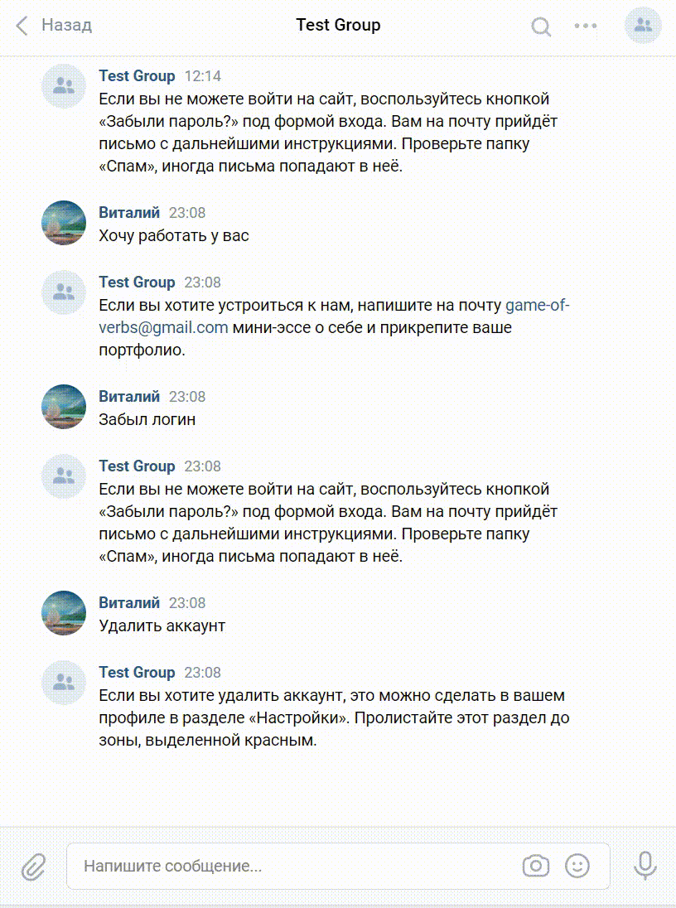

# "Game Of Verbs" Telegram and VK technical support service Bot

"Game Of Verbs" Telegram and VK technical support service Bot is the bot that helps to close all typical questions of the "Game Of Verbs" blog users.

## Prerequisites

Python3 should be already installed. Use `pip` to install dependencies:
```bash
pip install -r requirements.txt
```

## Installation for developer mode
You have to set TELEGRAM_TOKEN, VK_TOKEN, CHAT_ID, PROJECT_ID, GOOGLE_APP_CREDENTIALS_FILE, SESSION_ID and TRAINING_PHRASES_FILE environment variables before using the script.

1. Create .env file in the project directory.
2. Create the bot and get a token from Telegram, see [this tutorial](https://www.siteguarding.com/en/how-to-get-telegram-bot-api-token) for instructions. Copy your Telegram API token to .env file:
```
TELEGRAM_TOKEN="1234567890:AAHOoGbQZQripXSKTn1ZRmKf6g3-wwwwwww"
```
3. Create the VK group and get a token from VK, see [this tutorial](https://vk.com/dev/access_token?f=2.%20%D0%9A%D0%BB%D1%8E%D1%87%20%D0%B4%D0%BE%D1%81%D1%82%D1%83%D0%BF%D0%B0%20%D1%81%D0%BE%D0%BE%D0%B1%D1%89%D0%B5%D1%81%D1%82%D0%B2%D0%B0) for instructions. Copy your VK API token to .env file:
```
VK_TOKEN="5f00c1bb11b22d3333a0b444a555d6666d1f7777c2c5e888888888c999e00000e0a3bfa11111b22222a"
```
4. CHAT_ID is the user id of the Telegram user to send bot status (DEBUG, ERROR, INFO) messages to him. Copy it to .env file:
```
CHAT_ID="123456789"
```
5. Create the DialogFlow account [here](https://dialogflow.cloud.google.com/#/login). Then create the DialogFlow project and get the project id, see [this tutorial](https://cloud.google.com/dialogflow/docs/quick/setup) for instructions. Copy it to .env file:
```
PROJECT_ID="pelagic-berm-123456"
```
6. Create the DialogFlow agent, see [this tutorial](https://cloud.google.com/dialogflow/docs/quick/build-agent) for instructions. Make sure that use the Russian language for the agent. Then create new `Intent` and add there `Training phrases` and `Response`.
7. Create a service account key, see [this tutorial](https://cloud.google.com/docs/authentication/getting-started). A JSON key file is downloaded to your computer. Copy it to the project folder and add the file's full path to .env file:
```
GOOGLE_APP_CREDENTIALS_FILE="C:\\Projects\\recognize-speech-bot\\pelagic-berm-123456-a00ce1c22cda.json"
```
8. `session_id` - this is a unique string to distinguish one user from another. You can use Telegram user ID for example. Copy it to .env file:
```
SESSION_ID="123456789"
```
9. `TRAINING_PHRASES_FILE` - the path to the training phrases file. It needs to train DialogFlow by API. Copy it to .env file:
```
TRAINING_PHRASES_FILE="training_phrases.json"
```

## Usage

For Telegram bot run python script:
```sh
python telegram_bot.py
```
For VK bot run python script:
```sh
python vk_bot.py
```
Use Ctrl+C to interrupt the script.   

For training DialogFlow by API run python script:
```sh
python learning.py
```

## Installation for production mode and deploy
For deploying on [Heroku](https://www.heroku.com) you should:
1. Login or register there.
2. Create a new app.
3. Connect GitHub repository.
4. Create `Procfile` in the project root directory and add the text:
```
bot-vk: python3 vk_bot.py
bot-tg: python3 telegram_bot.py
```
5. Add TELEGRAM_TOKEN, VK_TOKEN, CHAT_ID, PROJECT_ID and SESSION_ID environment variables in the Settings tab of the Heroku site. Then declare your env variables: The GOOGLE_CREDENTIALS variable is the content of JSON file as is (use JSON file from `Installation for developer mode` topic of README). The GOOGLE_APPLICATION_CREDENTIALS env variable in the string "google-credentials.json".
6. Add the buildpack from the command line:
```sh
heroku buildpacks:add https://github.com/gerywahyunugraha/heroku-google-application-credentials-buildpack -a app_name
```
where app_name is the app's name you create.
7. Don't forget to renew the project repository on Heroku.

## How bots work
1. Telegram bot:


2. VK bot:


## Meta

Vitaly Klyukin — [@delphython](https://t.me/delphython) — [delphython@gmail.com](mailto:delphython@gmail.com)

[https://github.com/delphython](https://github.com/delphython/)
